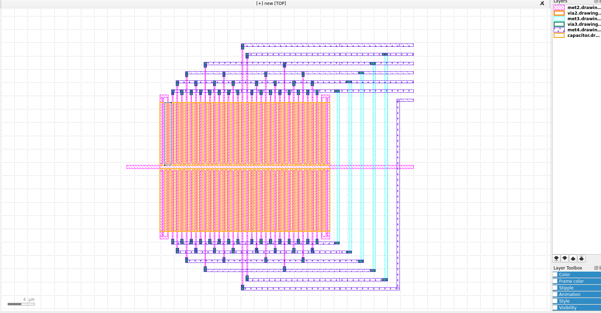
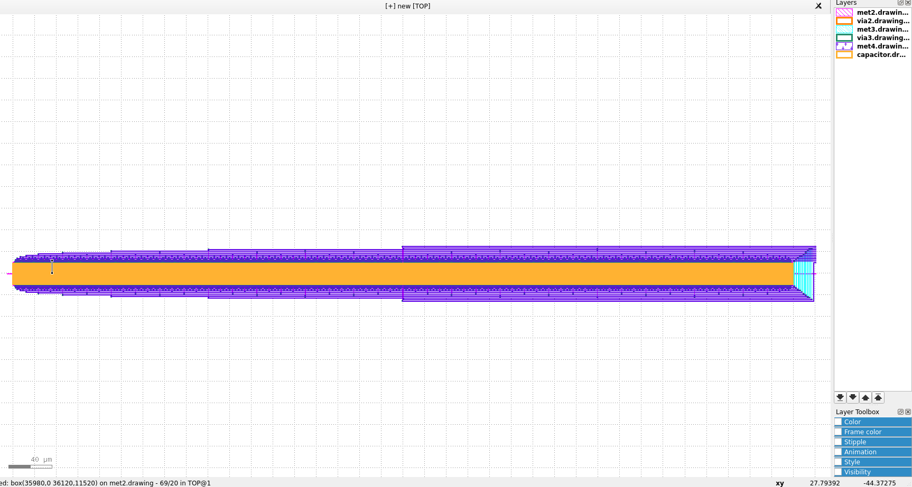
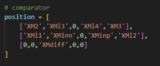
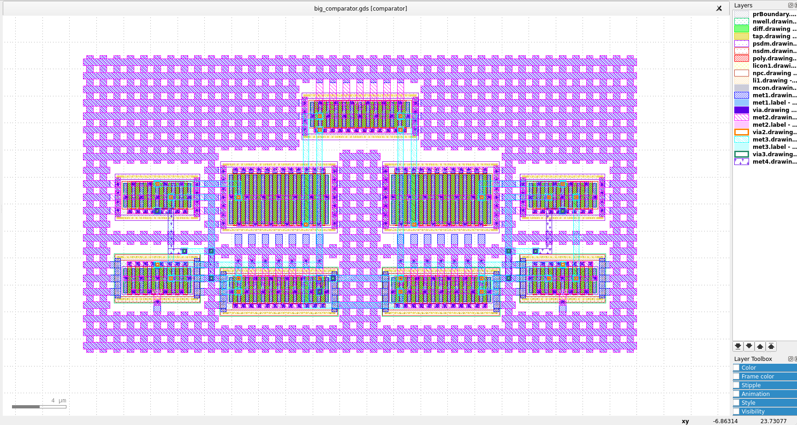
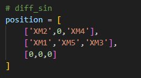

README
-

A2G (Anan Analog Generator)
=

OpenMPW6に提出するGDSを楽して設計するために，  
試行錯誤して生まれたプログラム  
      
回路レイアウトを手設計するなんて，面倒すぎる．．．  
 
ブロック設計と呼ばれる手法を採用  
ブロック設計とは，素子と配線のレイアウトをブロック単位で配置する設計手法

### 使用する際の注意点

- ネットリストは自力で用意する
- 素子サイズは自力で設計する
- 配置は好みがあるため，自力で頑張る
- どこかでプログラムが止まった場合，自力で直す
- MOSFETとRESISTOR実装済み，CAPACITORまだ．．．

### 説明

- magicの設定 export PDKPATH=/tmp/caravel_tutorial/pdk/sky130A
- NumberLinkの実行ファイル作成（make）
- python3 main.py　-> GDS作成

## 設定
- ./scripts/setting.pyをいじるといろいろ変わる
    - CELLNAMEでネットリスト名＝subサーキット名を設定
    - POSITION_PLAN でおおまかな配置を指定
- ネットリストを./netlist下に入れる

### プログラムの流れ

1. 準備
    1. ネットリストから素子情報取得
    1. 素子ごとのGDSを作成
    1. ブロック単位でレイアウトを管理
1. 配置
    1. 配置戦略を決める
    1. 実際に配置
    1. 出来るだけレイアウトサイズが小さくなるように圧縮
1. 配線
    1. 配線対となる配線ブロック座標を見つける
    1. 対称性とかクロス配線とかいろいろ面倒
    1. ナンバーリンクソルバー実行（https://github.com/kotarot/pynq-router.git）
1. 保存
    1. GDSの作成に必要な情報を保存
    1. 素子，配線ブロックの配置座標など
1. レイアウト作成
    1. magic（くせあり）で作成
    1. 電源メッシュとかいろいろオプションあり

### おまけ

klayoutのマクロでCDACのキャパシタアレイを作成  
->./klayout/macro/make_cdac.py  
klayoutのマクロにコピー&ペーストして使用  
Resolution（変数名:bit）をパラメータとした．  
10bitとか設定したらレイアウトがめちゃ長くなる．．．

## 実例

  

### ./netlist/comparator.spice  

### ./netlist/comparator.spice  

### ./netlist/comparator.spice  

License
=
A2G is licensed under the Apache License, Version 2.0. See [LICENSE](LICENSE.txt) file for details.
